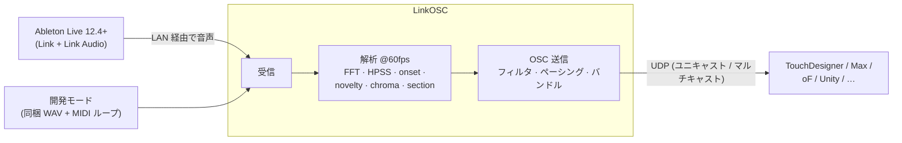
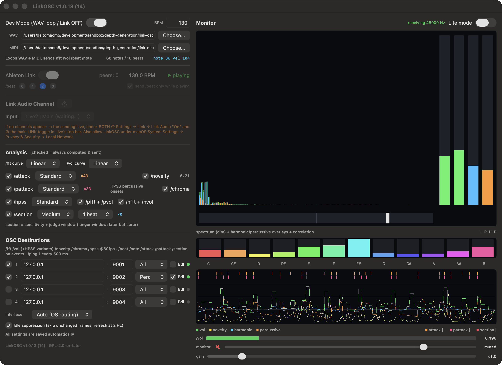
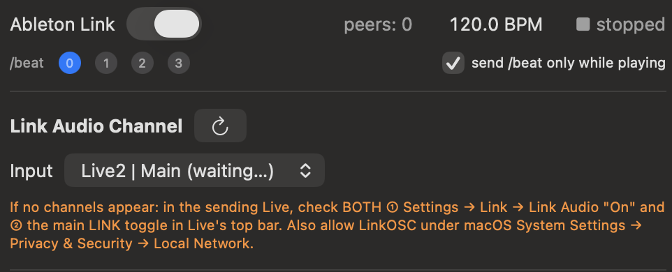
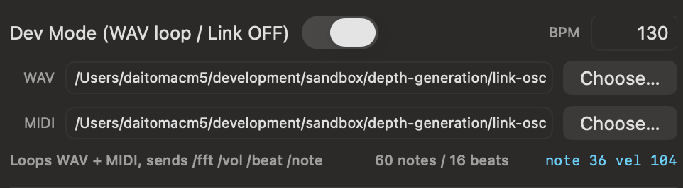
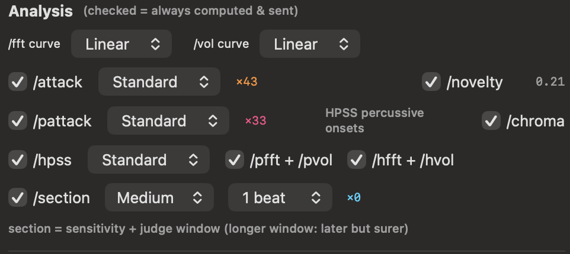
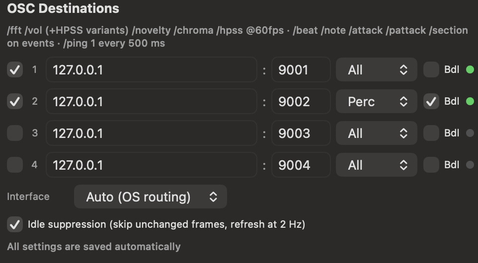
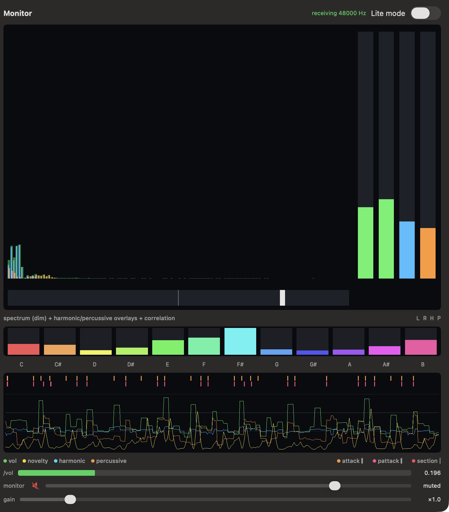

# LinkOSC ユーザーマニュアル

*アプリバージョン 1.0.12 対応。English version: [MANUAL.md](MANUAL.md)*

LinkOSC は **Ableton Live の音を Link Audio で受信**し(仮想オーディオドライバ不要)、
60fps で解析して、結果を **OSC** として最大 4 宛先へ送信する macOS ユーティリティです。
TouchDesigner / Max/MSP / openFrameworks / Unity / ブラウザなど、OSC を受けられる
あらゆる環境のオーディオリアクティブ映像を駆動できます。





---

## 目次

1. [インストールと初回起動](#1-インストールと初回起動)
2. [Ableton Live と使う (クイックスタート)](#2-ableton-live-と使う-クイックスタート)
3. [Live なしで使う (開発モード)](#3-live-なしで使う-開発モード)
4. [解析リファレンス](#4-解析リファレンス)
5. [OSC 宛先](#5-osc-宛先)
6. [モニターカラムとビジュアライザ](#6-モニターカラムとビジュアライザ)
7. [OSC を受信する側の作り方](#7-osc-を受信する側の作り方)
8. [バックグラウンド動作とパフォーマンス](#8-バックグラウンド動作とパフォーマンス)
9. [CLI 診断モード](#9-cli-診断モード)
10. [トラブルシューティング](#10-トラブルシューティング)

---

## 1. インストールと初回起動

1. [Releases](https://github.com/daitomanabe/link-osc-app/releases) から
   `LinkOSC-x.y.z.zip` をダウンロード・解凍し、`LinkOSC.app` を好きな場所へ
   (Applications でもプロジェクトフォルダでも可)。
2. アプリは ad-hoc 署名のみ(ノータライズなし)。初回は **右クリック → 開く**、
   または一度だけ:
   ```bash
   xattr -dr com.apple.quarantine LinkOSC.app
   ```
3. 起動時に **ローカルネットワーク** へのアクセス許可を求められるので許可して
   ください。Link のピア発見も Link Audio も LAN 上の UDP マルチキャストで
   動くため、これが無いとピアもチャンネルも一切見えません。

要件: macOS 13 以降、Apple Silicon。設定はすべて自動保存されます
(保存ボタンはありません)。ウィンドウタイトルに実行中のバージョンが出ます
(例: `LinkOSC v1.0.12 (13)`)。

## 2. Ableton Live と使う (クイックスタート)



1. **Live (12.4 以降) 側** — 同一ネットワーク(同じマシンか有線 LAN 推奨):
   - 設定 → Link → **Link Audio「On」**
   - **画面左上のトランスポートの LINK トグル**も ON。
     ⚠️ この 2 つは別のスイッチで、**両方**必要です。設定画面の Peers 欄に
     "Enable Link to show available peers" と出ている間は、メインの LINK が
     まだ OFF です。
2. LinkOSC 側は **Ableton Link** を ON、**Dev Mode** を OFF に。
   `peers:` が 1 以上になり、テンポが Live に追従します。
3. **Link Audio Channel** でチャンネルを選択 — `Live | Main` が Live の
   マスター出力で、各トラックも個別に公開されます。音が流れ始めるまで数秒
   かかることがあります。一覧は 2 秒ごとに再取得され、**↻** ボタンで探索を
   やり直せます。
4. OSC 宛先を 1 つ以上有効にし([§5](#5-osc-宛先))、ステータスドットが
   緑になるのを確認。
5. 受信側の確認は同梱モニターで:
   ```bash
   python3 tools/osc_monitor.py 9001
   ```

`/beat` (0 1 2 3) は **Link タイムライン**由来なので、音声のバッファリングで
遅延があっても Live のトランスポートに正確にロックします。
**send /beat only while playing** を ON にすると、Live の停止中は `/beat` も
止まります。

## 3. Live なしで使う (開発モード)



**Dev Mode** を ON にすると、Live なしで受信側の開発ができます:

- Link / Link Audio は無効になり、同梱の **140BPM・32 拍の WAV ループ**が
  本番と*全く同じ*解析 → OSC チェーンを流れます。
- **Bundled** メニューから dry 版とエフェクト付き版を切り替えられます。
- 同梱の**ドラム MIDI ループ**がノートオンごとに `/note <note> <velocity>` を
  発火し、`/beat` は設定 BPM でフリーランします。
- **Auto BPM** をクリックすると連続カウントを開始し、**Stop** で手動設定に戻ります。
  約4〜6秒でロックし、候補は必ず **90〜180 BPM**、同点に近い場合は
  110〜140 BPMを弱く優先します。利用可能ならループ長とMIDI拍数も補助情報にします。
- WAV / MIDI は自分のファイルに差し替え可能。保存されたパスが存在しなければ
  同梱データへ自動フォールバックします(アプリを別マシンへ移しても必ず動く)。
  MIDI パスを空にすると `/note` は無効。
- WAV はモニター出力から聴こえます。不要ならモニターの **mute / volume** で
  消音してください(解析・OSC には影響しません)。

決定的な入力で全メッセージが発火するので、受信側の開発・デバッグは
開発モードで行うのがおすすめです。

## 4. 解析リファレンス



**チェックの付いた解析は必ず計算・送信され、外した解析は CPU を消費しません。**
チェーン全体は [flucoma-core](https://github.com/flucoma/flucoma-core) の
アイデアを 60fps 用に軽量移植したものです。受信ステレオのモノミックスに対して
FFT サイズ 2048 (Hann) で動作します。

### レスポンスカーブ (`/fft` `/vol` と HPSS 変種)

スペクトラムと音量に独立したカーブを送信前に適用できます:

| カーブ | 効果 | 使いどころ |
|---|---|---|
| Linear | 生の値 | 受信側で自由に加工したいとき |
| Sqrt | 小さい値を持ち上げる (√x) | 静かなパートで映像が「死ぬ」とき |
| Log | 低レベルを最も強くブースト | 常に何かが動いていてほしいとき |
| Pow² | ノイズフロアを抑える (x²) | 大きい音だけに反応させたいとき |
| Pow³ | 極端なピーク強調 (x³) | ヒットのみに反応させたいとき |

### `/attack` — 全帯域オンセット検出

スペクトラルフラックス + 適応しきい値(移動中央値 × ratio)。プリセット:

| プリセット | 性格 | パラメータ (平滑 / ratio / 再トリガ禁止 / 下限) |
|---|---|---|
| Tight | 速い連打も拾う — ハイハット、ロール | 1 frame / 1.6× / 4 frames (~67ms) / 0.008 |
| Standard | 一般的なドラム | 3 / 2.0× / 8 frames (~133ms) / 0.012 |
| Smooth | 強いヒットのみ — キック/スネア級 | 5 / 2.8× / 15 frames (~250ms) / 0.02 |

float 引数はオンセット強度で、フラッシュやスケールのインパルスにそのまま
使えます。

### `/pattack` — percussive 成分のみのオンセット

同じ検出器に **HPSS の percussive スペクトラム**を入力したもの。持続音の
盛り上がりでは発火しなくなるため、**ドラムにロックさせたいエフェクトは
こちら**を使ってください。プリセットは独立。ON にすると HPSS の計算も
自動的に有効になります。

### `/hpss` — ハーモニック / パーカッシブ分離

メディアンフィルタ HPSS(時間方向メディアン → harmonic、周波数方向メディアン
→ percussive、Wiener ソフトマスク)。`/hpss` は 2 つのエネルギー合計値、
分離後のスペクトラム/音量は `/pfft` `/pvol`(percussive)と `/hfft` `/hvol`
(harmonic)で送られます。

| プリセット | カーネル (時間 × 周波数) | 性格 |
|---|---|---|
| Fast | 7 × 17 | 最低レイテンシ・最も反応的・分離は浅い |
| Standard | 17 × 31 | バランス型 (≈ flucoma デフォルト) |
| Deep | 31 × 63 | 最強の分離・にじみ/遅延が増える |

目安: **リズム反応**の映像は `/pfft` `/pvol` `/pattack` から、
**パッド/トーン反応**は `/hfft` `/hvol` から駆動する。

### `/novelty` — スペクトラル新規性

直近 ~133ms と、その前の ~133ms の平均スペクトラムのコサイン距離。
音色が*何かしら*変化すると上がるので、「何かが起きている」度合いのスカラー
としてカメラワークやシーンのエネルギーに便利です。

### `/chroma` — 12 ピッチクラス

55Hz–8kHz のビンを C…B の 12 クラスに畳み込み、フレームごとに最大値で正規化。
ハーモニーからカラーパレットや 12 要素のレイアウトを駆動できます。

### `/section` — 小節頭での展開検出

キックが抜けた・レイヤーが入った、といったアレンジの変化を検出し、
**Link タイムラインの小節頭に量子化して**発火します:

1. 各小節頭の後、帯域プロファイル **[sub, low, mid, high, percussive]** を
   **ジャッジウィンドウ**(1/256 / 1/128 / 1/64 / 1/32 / 1/16 / 1/8 /
   ¼ / ½ / 1 / 2 拍。デフォルト 1 拍)にわたって平均します。60fpsの解析
   1フレームより短い設定は次の解析フレームで即判定し、長い設定ほど多くの
   音声を平均します。
2. 平均プロファイルを直近の小節頭と比較。全体の大きな変化 **または**
   単一帯域の強い変化で発火 — 大音量のミックスからキックだけが消えても
   見逃しません。
3. 感度 High / Medium / Low = 変化しきい値 0.25 / 0.4 / 0.6。

ペイロード: `float magnitude, float×5 deltas`。**負のデルタ = その帯域が
消えた**(キック抜き → sub と percussive が強い負)。帯域の目安 (48kHz):
sub ≈ 0–560Hz、low ≈ 560Hz–1.7kHz、mid ≈ 1.7–8kHz、high ≈ 8kHz 以上。

## 5. OSC 宛先



UDP 宛先は最大 4 つ。各行の項目:

| 項目 | 意味 |
|---|---|
| チェックボックス | この宛先の有効/無効 |
| host : port | IPv4 またはホスト名。`224.0.0.0–239.255.255.255` を入れるとその宛先は**マルチキャスト**になる |
| フィルタ | アドレスフィルタのプリセット (下表) |
| **Bdl** | opt-in の **OSC バンドルモード** — フレームを ≤1400B にチャンクした `#bundle` にまとめて送る。datagram 数が減るが、受信側のバンドル対応が必要 |
| ステータスドット | 灰 = 無効 · 橙 = 接続中 · 緑 = 送信中 · 赤 = ドロップ発生 (受信側が到達不能/遅い)。**ホバーすると実際の送出経路**が見える (例: `sending — via en0 · 10.0.0.193`) |

### フィルタプリセット

| プリセット | 送信されるアドレス |
|---|---|
| All | すべて |
| Streams | `/fft /vol /pfft /pvol /hfft /hvol /hpss /novelty /chroma` |
| Events | `/beat /note /attack /pattack /section` |
| Perc | `/pfft /pvol /pattack /hpss /beat` — 「ドラムだけに反応」セット |

**`/ping` はフィルタに関係なく常に送信**されるので、受信側は生死判定を
常に行えます(推奨タイムアウト 2 秒)。

### マルチキャスト

host にグループアドレス(例 `239.10.0.1`)を入れるだけで、**グループに join
した受信者全員**に 1 回の送信で届きます(`IP_ADD_MEMBERSHIP`)。TTL は 1
(同一セグメント内のみ)。**有線 LAN 推奨** — Wi-Fi のマルチキャストは低速な
レガシーレートで送られ損失も大きいため、マルチキャスト宛先が有効な間は
アプリ内にも警告が表示されます。

### Interface (送出 NIC)

`Interface: Auto (OS routing)` はほとんどのユニキャストで正解です — OS が
宛先サブネットに一致する NIC を選びます。固定が必要なのは:

- **二重ホーム構成でのマルチキャスト**(インターネットは Wi-Fi、映像
  ネットワークは有線、など)。固定しないと OS は*プライマリ*インターフェース
  から送出し、有線側の受信者には一切届きません。
- Wi-Fi と有線が**同じサブネット**につながっていて、OS が遅い方を選ぶとき。

セーフティネット: ネットワーク構成の変化(ケーブル挿抜・Wi-Fi 切替)で接続は
自動的に張り直されます。固定した NIC が消えると**オレンジの警告を出して Auto
へフォールバック**し、NIC が戻れば自動で再固定 — 「保存された存在しない NIC の
せいで出力が沈黙する」ことはありません。実際の経路はドットのツールチップで
確認できます。

### アイドル抑制

**Idle suppression** が ON(デフォルト)の間、値が変化していない stream
メッセージ(無音・静止)はスキップされ、最低 2Hz でリフレッシュ送信されます。
イベントと `/ping` は絶対に抑制されません。受信側が「アドレスごとに最新値を
保持する」実装(推奨)なら見た目の違いはゼロで、無音時のパケットが約 96%
減ります。メッセージの*到着頻度そのもの*を信号として使う受信側の場合のみ
OFF にしてください。

### 送信スケジューリング (自動)

イベントは遅延ゼロで先頭に。大きいスペクトラム 3 種(`/fft` `/pfft` `/hfft`、
各 ~670B)は +1/+2/+3ms にずらして送られ、シングルスレッドの受信側
(Max、TouchDesigner)のバースト取りこぼしを防ぎます。送信は接続ごとに
バッチ化・DSCP マーキング(interactive video)され、in-flight 上限で
ゲートされます — 詰まった宛先には際限なくキューせずドロップします
(OSC は損失前提。赤ドットがそのサインです)。

## 6. モニターカラムとビジュアライザ



- **スペクトラム表示** — 全帯域(暗)+ HPSS オーバーレイ: **シアン =
  harmonic**、**オレンジ = percussive**。右のメーターは **L R** が入力
  レベル、**H P** が harmonic/percussive エネルギー。下の細いバーは
  **ステレオ相関**(+1 モノ … −1 逆相)。
- **クロマバー** — C…B の 12 ピッチクラス。
- **ヒストリーグラフ** — 直近 8 秒の **vol**(緑)、**novelty**(黄)、
  **harmonic**(シアン)、**percussive**(オレンジ)。イベントマーカー:
  上部の短いティック = `/attack`(橙)と `/pattack`(ピンク)、全高の縦線 =
  `/section`(赤)。
- **receiving …Hz** — 受信ストリームのサンプルレート。流れていなければ
  "no audio"。
- **monitor mute / volume** — 受信した Link Audio(ジッターバッファ済み)
  または開発モード WAV の*可聴*モニターの制御。**解析と OSC には一切影響
  しません。**
- **gain** — 解析*前*に適用される入力ゲイン。`/fft` `/vol` 以下すべての値に
  効きます。小さい音源の正規化に。
- **Lite mode** — Metal 描画を全停止し UI 更新を 1Hz に。解析と OSC は
  60fps のまま。確認が終わった本番中はこれを ON に。

## 7. OSC を受信する側の作り方

ワイヤフォーマットの完全な仕様は **[OSC-SPEC.md](../OSC-SPEC.md)** に
あります — typetag・レンジ・校正値・ペーシング・キープアライブ・JSON
サマリーまで自己完結した、機械可読向けの仕様書です。**AI に受信側を
作らせる場合は、このファイルをそのまま会話に貼ってください。**

受信側の原則:

- **UDP は損失前提。** アドレスごとに*最新値*を保持し、全フレームの到着や
  順序を仮定しない。
- stream は*最大* 60fps(アイドル抑制中は最低 2Hz)、イベントは発生時、
  `/ping 1` が 500ms ごとの生存信号。
- **Bdl** 宛先では `#bundle` を再帰的に展開する。
- 何も書かずに確認するなら:
  ```bash
  python3 tools/osc_monitor.py 9001
  ```

## 8. バックグラウンド動作とパフォーマンス

- アプリは**自分から最前面に出ることはなく**、完全にバックグラウンドで
  動き続けます。App Nap を内部で無効化しているため、ウィンドウが隠れて
  いても他アプリがフルスクリーンでも、60fps の解析と OSC 送信は
  止まりません。
- ウィンドウが完全に隠れると描画は自動停止(描画コストゼロ)。解析・OSC は
  無影響。Lite mode は同じことを明示的に行い、さらに UI を 1Hz に落とします。
- Apple Silicon での目安: DSP ≈ 0.5ms/フレーム、UI はビジュアライザ ON で
  1 コアの ~10%、Lite mode / バックグラウンドではほぼゼロ。
- ウィンドウを閉じてもアプリ(と OSC 出力)は動き続けます。Dock アイコンの
  クリックで再表示。

## 9. CLI 診断モード

デバッグビルド(`swift build`)にはセルフテストが入っています。「動かない」
ときに*どの層*が壊れているかを切り分けられます:

| コマンド | 検証内容 |
|---|---|
| `LinkOSC --version` | バージョン/ビルド |
| `LinkOSC --probe` | Link ピアと Link Audio チャンネルを 10 秒間観測し、判定コメント付きで表示 |
| `LinkOSC --publish` | 440Hz テストチャンネルを公開 — 受信検証用の「偽 Live」 |
| `LinkOSC --rxtest 9099 Main` | チャンネル購読 → 受信フレーム数の報告 |
| `LinkOSC --devtest 9099` | 開発モードループ + 全解析チェーンのセルフテスト |
| `LinkOSC --bpmtest` | Auto BPM の90/110/128/140/180合成試験 + 同梱WAV試験 |
| `LinkOSC --selftest 9099` | FFT 校正 / Link タイムライン / OSC エンコード |
| `LinkOSC --ifacetest` | インターフェース固定: NIC 列挙・経路制約の証明・固定マルチキャスト配送 |
| `LinkOSC --desttest 9070` | 宛先別フィルタ / バンドル / マルチキャスト |
| `LinkOSC --pacetest 9099` | +1/+2/+3ms 送信スタガリングの実測 |
| `LinkOSC --oscstress` | 送信バックログクラッシュ対策の回帰テスト |
| `LinkOSC --bench` | ステージ別 DSP コスト (release ビルドで実行) |
| `LinkOSC --docshot out.png [delay]` | delay 秒後に UI を自己スクリーンショット — このマニュアルの画像の再生成用 |

## 10. トラブルシューティング

| 症状 | 対処 |
|---|---|
| チャンネルが出ない | Live 側で設定 → Link → Link Audio「On」**と**メイン LINK トグルの**両方**を確認。同一 LAN か。macOS 設定 → プライバシーとセキュリティ → **ローカルネットワーク**で LinkOSC を許可。**↻** を押す。`--probe` が判定してくれる |
| チャンネルは見えるが "no audio" | 数秒待つ / チャンネルを選び直す / Live を再生する。L/R メーターと `receiving …Hz` を確認 |
| 受信側に何も来ない | ドットを見る: 灰 = 宛先が無効、橙 = 接続中 (到達不能)、赤 = ドロップ (受信側が遅い)。**フィルタ**が目的のアドレスを除外していないか、ポート番号、`/ping` が届くか (これは必ず届くはず) を確認 |
| マルチキャストが届かない | 受信側の**グループ join** が必要。**有線** LAN を使う。二重ホームの送信側では **Interface** を映像ネットワーク側の NIC に固定 |
| `/beat` が動かない | Link ピアが 0 (1 行目参照)、または **send /beat only while playing** が ON で Live が停止中 |
| 反応が弱い/暴れる | まず **gain**、次にレスポンスカーブを調整。ドラムだけに反応させたいなら `/pfft` `/pvol` `/pattack` を使う |
| 「壊れているため開けません」 | 未ノータライズアプリの Gatekeeper: 右クリック → 開く、または `xattr -dr com.apple.quarantine LinkOSC.app` |
| アプリから音が出て困る | それはモニター出力です — ミュートしてください (解析/OSC は無影響) |
| ウィンドウが消えた | ウィンドウを閉じてもアプリは動作継続。Dock アイコンで再表示 |
