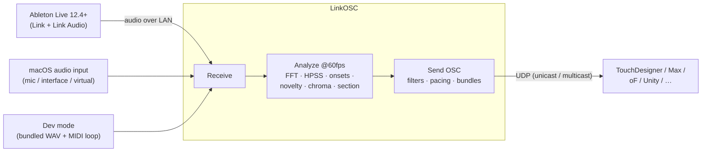

# LinkOSC User Manual

*For app version 1.0.17. 日本語版は [MANUAL.ja.md](MANUAL.ja.md) にあります。*

LinkOSC receives audio from **Ableton Live over Link Audio** (no virtual audio
driver) or a selected macOS input device, analyzes it at 60 fps, and streams the results as **OSC** to up to 4
destinations — for driving visuals in TouchDesigner, Max/MSP, openFrameworks,
Unity, the browser, or anything else that speaks OSC.




---

## Contents

1. [Install & first launch](#1-install--first-launch)
2. [Quick start with Ableton Live](#2-quick-start-with-ableton-live)
3. [Quick start without Live (Dev Mode)](#3-quick-start-without-live-dev-mode)
4. [Analysis reference](#4-analysis-reference)
5. [OSC destinations](#5-osc-destinations)
6. [Monitor column & visualizers](#6-monitor-column--visualizers)
7. [Receiving the OSC](#7-receiving-the-osc)
8. [Background behavior & performance](#8-background-behavior--performance)
9. [CLI diagnostics](#9-cli-diagnostics)
10. [Troubleshooting](#10-troubleshooting)

---

## 1. Install & first launch

1. Download `LinkOSC-x.y.z.zip` from
   [Releases](https://github.com/daitomanabe/link-osc-app/releases), unzip,
   and move `LinkOSC.app` anywhere (Applications, a project folder — it doesn't
   matter).
2. The app is ad-hoc signed, not notarized. On first launch **right-click →
   Open**, or clear quarantine once:
   ```bash
   xattr -dr com.apple.quarantine LinkOSC.app
   ```
3. macOS will ask for **Local Network** access — allow it. Link discovery and
   Link Audio both run over UDP multicast on your LAN; without this permission
   the app sees no peers and no channels.

Requirements: macOS 13+, Apple Silicon. All settings save automatically
(UserDefaults) — there is no Save button anywhere.

The window title shows the running version (e.g. `LinkOSC v1.0.17 (21)`).

## 2. Quick start with Ableton Live


1. **In Live (12.4 or newer), on the same network** — ideally the same machine
   or wired LAN:
   - Settings → Link → **Link Audio: On**
   - Turn on the **LINK toggle in Live's top-left transport bar**.
     ⚠️ These are two different switches and *both* are required. If Live's
     Peers list says *"Enable Link to show available peers"*, the main LINK
     toggle is still off.
2. In LinkOSC, make sure **Ableton Link** is on and **Dev Mode** is off.
   `peers:` should become ≥ 1 and the tempo should track Live.
3. Under **Audio Input**, select **Ableton Link Audio**, then pick a channel — `Live | Main` is Live's master
   output; every track is also published individually. Audio can take a few
   seconds to start flowing. The list re-polls every 2 s; the **↻** button
   restarts discovery if a channel you expect is missing.
4. Enable at least one OSC destination (see [§5](#5-osc-destinations)) and
   watch its status dot turn green.
5. Verify on the receiving side with the bundled monitor:
   ```bash
   python3 tools/osc_monitor.py 9001
   ```

`/beat` (0 1 2 3) comes from the **Link timeline**, so it stays locked to
Live's transport even if audio buffering adds latency. With
**send /beat only while playing** checked, `/beat` pauses when Live's
transport stops.

To use a microphone, audio interface, aggregate device, or virtual input, select
it from **Audio Input → Source**. Allow microphone access when macOS asks. Link
may remain enabled: audio analysis uses the selected device while `/beat` still
uses the Link timeline. Local inputs are deliberately not played through the
monitor output, which prevents feedback. For multi-channel interfaces, the
**Channel** menu offers non-overlapping stereo pairs (`Stereo 1–2`, `3–4`, …)
and every individual mono input. The source and channel selections are restored
at the next launch; an invalid saved channel falls back to the first valid pair.

## 3. Quick start without Live (Dev Mode)


Toggle **Dev Mode** to work on your receiver with no Live running:

- Link and Link Audio are disabled; a bundled **140 BPM, 32-beat WAV loop**
  plays through the *exact same* analysis → OSC chain.
- Use the **Bundled** menu to switch between the dry loop and an effects version.
- A bundled **drum MIDI loop** emits `/note <note> <velocity>` on every
  note-on, and `/beat` free-runs at the set BPM.
- Click **Auto BPM** to start continuous counting; click **Stop** to return to
  manual BPM. The detector locks after about 4–6 seconds, only considers
  **90–180 BPM**, and uses 110–140 BPM as a weak tie-break preference. Loop
  duration and matching MIDI beat count are used as additional hints when available.
- You can point WAV / MIDI at your own files; if a saved path no longer exists
  the app falls back to the bundled data (so the app keeps working when moved
  to another machine). Clearing the MIDI path disables `/note`.
- The WAV is audible through the Monitor output — use the monitor **mute /
  volume** control if you don't want to hear it (analysis and OSC are not
  affected).

Dev Mode is the recommended way to build and debug a receiver: deterministic
input, all message types firing, no Live needed.

## 4. Analysis reference


**A checked analysis is always computed and sent; an unchecked one costs no
CPU.** The whole chain is a lightweight 60 fps port of ideas from
[flucoma-core](https://github.com/flucoma/flucoma-core). Everything operates on
a mono mix of the received stereo at FFT size 2048 (Hann).

### Response curves (`/fft` `/vol` and their HPSS variants)

Independent curves for spectrum and volume, applied before sending:

| Curve | Effect | Use when |
|---|---|---|
| Linear | raw values | you want to shape response on the receiver side |
| Sqrt | boosts quiet detail (√x) | visuals feel "dead" in quiet passages |
| Log | strongest low-level boost | everything should stay visibly alive |
| Pow² | suppresses the noise floor (x²) | only loud content should react |
| Pow³ | extreme peak emphasis (x³) | strictly hits-only response |

### `/attack` — full-band onset detection

Spectral flux with an adaptive threshold (running median × ratio). Presets:

| Preset | Character | Parameters (smooth / ratio / retrigger gap / floor) |
|---|---|---|
| Tight | catches fast repeats — hi-hats, rolls | 1 frame / 1.6× / 4 frames (~67 ms) / 0.008 |
| Standard | general drums | 3 / 2.0× / 8 frames (~133 ms) / 0.012 |
| Smooth | strong hits only — kick/snare class | 5 / 2.8× / 15 frames (~250 ms) / 0.02 |

The float argument is the onset strength — usable directly as a flash/scale
impulse.

### `/pattack` — percussive-only onsets

The same detector fed with the **HPSS percussive spectrum** instead of the full
band. Sustained tonal swells no longer trigger it — this is the one to use for
drum-locked effects. Has its own preset picker. Enabling it implies computing
HPSS.

### `/hpss` — harmonic / percussive separation

Median-filtering HPSS (temporal median → harmonic, spectral median →
percussive, Wiener soft masks). `/hpss` sends the two summed energies; the
separated spectra/volumes are available as `/pfft` `/pvol` (percussive) and
`/hfft` `/hvol` (harmonic).

| Preset | Kernels (time × freq) | Character |
|---|---|---|
| Fast | 7 × 17 | lowest latency, most reactive, least separation |
| Standard | 17 × 31 | balanced (≈ flucoma defaults) |
| Deep | 31 × 63 | strongest separation, adds smearing/latency |

Rule of thumb: drive **rhythm-reactive** visuals from `/pfft` `/pvol`
`/pattack`, **pad/tonal-reactive** visuals from `/hfft` `/hvol`.

### `/novelty` — spectral novelty

Cosine distance between the mean spectrum of the last ~133 ms and the ~133 ms
before. Rises on *any* change in spectral content — useful as a "something is
happening" scalar for camera moves or scene energy.

### `/chroma` — 12 pitch classes

Bins from 55 Hz–8 kHz folded into pitch classes C…B, max-normalized per frame.
Drive color palettes or 12-element layouts from harmony.

### `/section` — arrangement-change detection at bar heads

Detects arrangement changes (a kick dropping out, a new layer entering) and
fires **only at bar heads**, quantized to the Link timeline:

1. After each bar head, the band profile **[sub, low, mid, high, percussive]**
   is averaged over the **judge window** (1/256 / 1/128 / 1/64 / 1/32 / 1/16 /
   1/8 / ¼ / ½ / 1 / 2 beats; default 1 beat). Windows shorter than one 60 fps
   analysis frame judge on the next frame; longer windows react later but average
   more audio.
2. The averaged profile is compared with recent bar heads. It fires on a large
   overall change **or** a strong single-band change — so a kick disappearing
   from an otherwise loud mix is *not* missed.
3. Sensitivity High / Medium / Low = change thresholds 0.25 / 0.4 / 0.6.

Payload: `float magnitude, float×5 deltas`. **Negative delta = that band
disappeared** (kick drop → strongly negative sub & percussive). Band ranges at
48 kHz: sub ≈ 0–560 Hz, low ≈ 560 Hz–1.7 kHz, mid ≈ 1.7–8 kHz, high ≈ 8 kHz+.

## 5. OSC destinations


Up to 4 UDP destinations, each with:

| Control | Meaning |
|---|---|
| checkbox | enable/disable this destination |
| host : port | IPv4 or hostname. A host of `224.0.0.0–239.255.255.255` switches this destination to **multicast** |
| filter | address-filter preset (below) |
| **Bdl** | opt-in **OSC bundle mode** — the frame is packed into `#bundle` packets chunked to ≤ 1400 B. Fewer datagrams, but the receiver must unpack bundles |
| status dot | gray = disabled · orange = connecting · green = sending · red = dropping (receiver unreachable/slow). **Hover it to see the actual egress path**, e.g. `sending — via en0 · 10.0.0.193` |

### Filter presets

| Preset | Addresses sent |
|---|---|
| All | everything |
| Streams | `/fft /vol /pfft /pvol /hfft /hvol /hpss /novelty /chroma` |
| Events | `/beat /note /attack /pattack /section` |
| Perc | `/pfft /pvol /pattack /hpss /beat` — the "react to drums only" set |

**`/ping` is always sent** regardless of filter, so receivers can always detect
liveness (recommended timeout: 2 s).

### Multicast

Set the host to a group address (e.g. `239.10.0.1`) — one send reaches every
receiver that **joins the group** (`IP_ADD_MEMBERSHIP`). TTL is 1 (same LAN
segment only). **Use wired Ethernet**: Wi-Fi multicast is transmitted at low
legacy rates and is lossy; the app shows this warning whenever a multicast
destination is enabled.

### Interface (egress NIC)

`Interface: Auto (OS routing)` is correct for most unicast — the OS picks the
NIC whose subnet matches the destination. Pin a specific NIC when:

- you send **multicast** on a multi-homed machine (internet on Wi-Fi + visuals
  network on Ethernet): the OS otherwise emits multicast on the *primary*
  interface and it never reaches the wired receivers;
- Wi-Fi and Ethernet are connected to the **same subnet** and the OS prefers
  the wrong one.

Safety net: connections are rebuilt automatically on any network change (cable
plug/unplug, Wi-Fi switch). If the pinned NIC disappears, the app **falls back
to Auto with an orange warning** and re-pins automatically when the NIC
returns — a saved-but-absent interface can never silently kill your output.
Verify what is actually happening via the status-dot tooltip.

### Idle suppression

With **Idle suppression** on (default), stream messages whose values haven't
changed (silence, freeze) are skipped and refreshed at ≥ 2 Hz. Events and
`/ping` are never suppressed. If your receiver is a latest-value store (the
recommended pattern), this is invisible — it just saves ~96 % of packets during
silence. Turn it off only if your receiver treats message *rate* as a signal.

### Send scheduling (automatic)

Events go out first with zero delay. The three large spectrum packets
(`/fft` `/pfft` `/hfft`, ~670 B each) are staggered +1/+2/+3 ms so single-
threaded receivers (Max, TouchDesigner) don't drop bursts. Sends are batched
per connection, DSCP-marked as interactive video, and gated by an in-flight
cap — a stalled destination drops packets instead of queueing unboundedly
(OSC is lossy by design; the red dot tells you it's happening).

## 6. Monitor column & visualizers


- **Spectrum view** — full spectrum (dim) with the HPSS overlays: **cyan =
  harmonic**, **orange = percussive**. Right-hand meters: **L R** input levels,
  **H P** harmonic/percussive energies. The thin bar below is **stereo
  correlation** (+1 mono … −1 out-of-phase).
- **Chroma bars** — the 12 pitch classes C…B, colored per class.
- **History graph** — the last 8 seconds of **vol** (green), **novelty**
  (yellow), **harmonic** (cyan), **percussive** (orange), with event markers:
  short top ticks = `/attack` (orange) and `/pattack` (pink), full-height lines
  = `/section` (red).
- **receiving …Hz** — sample rate of the incoming stream; "no audio" if
  nothing is flowing.
- **monitor mute / volume** — controls the *audible* monitoring of the
  received Link Audio (jitter-buffered) or the dev-mode WAV. **It never
  affects analysis or OSC.** Local audio inputs are not monitored to prevent feedback.
- **gain Auto / Manual** — input gain applied *before* analysis; affects `/fft`
  `/vol` and everything downstream. **Auto** targets a stable analysis level,
  summarizes minimum, maximum, median, average and peak over each 4-second
  block, updates only at the block boundary, and holds that gain for the next
  block. It targets a 0.95 peak, allows brief overshoot up to 1.05 before the
  published values are clamped to 0...1. Small changes are ignored and silence
  is not amplified. **Manual**
  exposes the `×0.1…×8.0` fader. The mode
  and manual value are saved; switching back to Manual restores its last value.
- **Adjusted / Raw** — selects the level shown by the on-screen spectrum, L/R
  meters, and history. Adjusted includes Auto/Manual gain; Raw is the input
  before analysis gain. Both histories are retained independently. This display
  setting never changes analysis or OSC output.
- **Lite mode** — stops all Metal rendering and slows UI updates to 1 Hz.
  Analysis and OSC continue at exactly 60 fps. Use it during the show once
  everything is verified.

## 7. Receiving the OSC

The complete wire-format contract is in **[OSC-SPEC.md](../OSC-SPEC.md)** — a
self-contained, machine-oriented spec (exact typetags, ranges, calibration,
pacing, keepalive, JSON summary). If you're building the receiver with an AI
assistant, paste that file into the conversation.

Ground rules for any receiver:

- **UDP is lossy by design.** Keep the *latest value* per address; never
  assume every frame arrives or arrives in order.
- Streams arrive at *up to* 60 fps (≥ 2 Hz refresh floor when idle-suppressed);
  events arrive when they happen; `/ping 1` every 500 ms is the liveness
  signal.
- On a **Bdl** destination, unpack `#bundle` recursively.
- Quick sanity check without writing anything:
  ```bash
  python3 tools/osc_monitor.py 9001
  ```

## 8. Background behavior & performance

- The app **never brings itself to the foreground**, and keeps running fully
  in the background: App Nap is disabled internally so the 60 fps loop and OSC
  output continue while the window is hidden or another app is fullscreen.
- Rendering auto-pauses while the window is fully occluded (zero GPU/CPU for
  drawing); analysis and OSC are unaffected. Lite mode does the same
  explicitly, plus slows the UI to 1 Hz.
- Typical cost on Apple Silicon: DSP ≈ 0.5 ms/frame; UI ≈ 10 % of one core
  with visualizers on, near zero in Lite mode / background.
- Closing the window keeps the app (and OSC output) running; reopen it by
  clicking the Dock icon.

## 9. CLI diagnostics

Debug builds (`swift build`) expose self-tests — useful when something
"doesn't work" and you want to know *which layer* is broken:

| Command | What it verifies |
|---|---|
| `LinkOSC --version` | version/build |
| `LinkOSC --probe` | shows Link peers & Link Audio channels for 10 s, with a verdict (Link off? Link Audio off? all good?) |
| `LinkOSC --publish` | publishes a 440 Hz test channel — a fake Live for testing reception on another machine |
| `LinkOSC --rxtest 9099 Main` | subscribe to a channel and report received frames |
| `LinkOSC --devtest 9099` | dev-mode loop + full analysis chain self-test |
| `LinkOSC --bpmtest` | Auto BPM synthetic 90/110/128/140/180 tests + bundled WAV |
| `LinkOSC --inputtest [--capture]` | Core Audio input enumeration and UID checks; optionally capture if permission is already granted |
| `LinkOSC --autogaintest` | automatic-gain block hold, statistics, silence guard, deadband, and peak ceiling |
| `LinkOSC --selftest 9099` | FFT calibration / Link timeline / OSC encoding |
| `LinkOSC --ifacetest` | interface pinning: enumerates NICs, proves the routing constraint, verifies pinned multicast delivery |
| `LinkOSC --desttest 9070` | per-destination filters / bundles / multicast |
| `LinkOSC --pacetest 9099` | measures the +1/+2/+3 ms send staggering |
| `LinkOSC --oscstress` | regression for the send-backlog crash guard |
| `LinkOSC --bench` | per-stage DSP cost (run on a release build) |
| `LinkOSC --docshot out.png [delay]` | self-screenshot of the live UI after `delay` s — regenerates the images in this manual |

## 10. Troubleshooting

| Symptom | Fix |
|---|---|
| No channels in the picker | In Live check **both** Settings → Link → Link Audio "On" **and** the main LINK toggle (top bar). Same LAN? Then macOS System Settings → Privacy & Security → **Local Network** → allow LinkOSC. Try **↻**. `--probe` gives a verdict |
| Channels listed but "no audio" | Give it a few seconds; re-pick the channel; press play in Live. Check the L/R meters and `receiving …Hz` |
| Receiver gets nothing | Watch the status dot: gray = destination disabled, orange = connecting (host unreachable), red = dropping (receiver slow). Check the **filter** preset isn't excluding your addresses; check the port; check `/ping` arrives (it always should) |
| Multicast doesn't arrive | Receiver must **join the group**; use **wired** LAN; on a multi-homed sender pin the **Interface** to the NIC of the visuals network |
| `/beat` doesn't move | Link peers = 0 (see first row), or **send /beat only while playing** is on and Live's transport is stopped |
| Values feel too weak/jumpy | Adjust **gain** first, then the response curves; for drum-only response use `/pfft` `/pvol` `/pattack` |
| "App is damaged / can't be opened" | Gatekeeper on an unnotarized app: right-click → Open, or `xattr -dr com.apple.quarantine LinkOSC.app` |
| Sound from the app is unwanted | That's the monitor — mute it (analysis/OSC unaffected) |
| Window gone | The app keeps running with the window closed — click the Dock icon |
